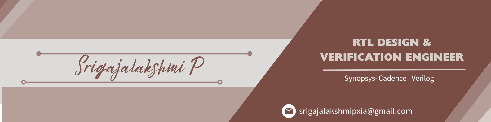

<!-- ═══════════════════════════════════════════════════════════════ -->
<!--                     BANNER & HEADER                           -->
<!-- ═══════════════════════════════════════════════════════════════ -->

 

 &nbsp;&nbsp;&nbsp;
 &nbsp;&nbsp;&nbsp;

---

## ⚡ About Me

I am a pre-final year **Electronics Engineering (VLSI D&T)** student at **Rajalakshmi Institute of Technology, Chennai**, specializing in digital design, RTL coding, and verification flows. Currently interning at **Struent Semiconductors**, I focus on building optimized hardware description and simulation workflows.

* 🎓 **ISWDP Level 1 Fellow** (Samsung · Synopsys · IISc) — Scored **92%** in core VLSI & design flow assessment.
* 🛠️ **ASIC/FPGA Stack** — RTL coding in Verilog/SystemVerilog, synthesis via Fusion Compiler, and validation with VCS & Verdi.
* 🚀 **Interests** — RISC-V microarchitecture, hardware acceleration, and physical design flows.

---

## 🛠️ Tech Stack

| Category | Skills & Tools |
| :--- | :--- |
| **HDLs & Logic** | `Verilog` `SystemVerilog` `VHDL` `Assembly` |
| **EDA Tools** | `Synopsys VCS` `Verdi` `Fusion Compiler` `Cadence Virtuoso` `Verilator` `GTKWave` |
| **FPGA & Embedded** | `Quartus Prime` `Altera DE2-115` `Raspberry Pi` `ESP32-S3` |
| **Programming** | `C` `Python` `Tcl (Scripting)` `Flutter` |
| **Hardware / PCB** | `KiCad` `TCAD SDE` |

---

## 📂 Projects

<table width="100%">
  <tr>
    <td width="50%" valign="top">
      <h3>🧠 FPGA CNN Digit Recognizer</h3>
      
Real-time MNIST handwritten digit classification implemented entirely in hardware on the <b>Altera DE2-115</b> FPGA. No CPU or OS.

      <ul>
        <li>Implemented parallel convolution, pooling, and dense layers in raw RTL.</li>
        <li>Designed real-time display and interface pipelines running at 25 MHz.</li>
      </ul>
      <code>Verilog</code> • <code>Quartus</code> • <code>DE2-115</code> • <code>VGA</code>
    </td>
    <td width="50%" valign="top">
      <h3>👾 Space Fighter — FPGA Game</h3>
      
A fully interactive space shooter designed and executed inside a single Verilog module without CPU or external controllers.

      <ul>
        <li>Engineered timing controllers for VGA output (640×480 @ 60Hz).</li>
        <li>Programmed dynamic parallel AI for enemy waves computed per-pixel.</li>
      </ul>
      <code>Verilog</code> • <code>FPGA Logic</code> • <code>VGA Timing</code>
    </td>
  </tr>
  <tr>
    <td width="50%" valign="top">
      <h3>🎙️ Diya — Offline Voice Assistant</h3>
      
A privacy-first, fully offline voice assistant operating locally on Raspberry Pi with no cloud dependencies.

      <ul>
        <li>Integrated offline wake-word, Vosk ASR, and Piper TTS engines.</li>
        <li>Optimized real-time audio pipeline and command scheduling.</li>
      </ul>
      <code>Embedded Linux</code> • <code>Python</code> • <code>Vosk ASR</code> • <code>Piper TTS</code>
    </td>
    <td width="50%" valign="top">
      <h3>✈️ Sky-fi — IoT Flying Platform</h3>
      
An ESP32-S3 powered wireless model plane operating on a custom designed PCB and real-time mobile interface.

      <ul>
        <li>Designed schematic and layout of the control board using KiCad.</li>
        <li>Implemented tilt-based flight stabilization and telemetry via Flutter app.</li>
      </ul>
      <code>ESP32-S3</code> • <code>KiCad</code> • <code>Flutter</code> • <code>PCB Design</code>
    </td>
  </tr>
</table>

---

## 💼 Experience

* **Student Intern** | **Struent Semiconductors** *(Apr 2026 – Present)*
  * Developing RTL designs in Verilog/SystemVerilog and validating functionalities using Verilator & GTKWave.
* **Hardware Intern** | **Susan Future Technologies** *(Oct 2025 – Jan 2026)*
  * Modeled outdoor Point-to-Point bridging systems and developed schematics using KiCad.

---

## 📜 Certifications & Achievements

* **ISWDP Fellowship** (Samsung · Synopsys · IISc) — Scored **92%** on core semiconductor workflows.
* **System Design through Verilog** (IIT Guwahati / NPTEL) — **Elite Silver (82%)**.
* **SoC Signoff Bootcamp** (NIELIT Govt. of India) — Logic synthesis and RTL check-off.
* **Circuit Design Challenge** (Tech Fusion '24) — **2nd Place** in hardware debugging.

---

## 🤝 Connect with Me

Passionate about VLSI Design, RTL Development, Physical Design, and Embedded Systems. I'm always open to collaborating on innovative hardware projects, sharing knowledge, and connecting with fellow engineers.

 &nbsp;&nbsp;&nbsp;
 &nbsp;&nbsp;&nbsp;

---

*"Hardware is the canvas. RTL is the brush. Every timing constraint is a discipline, and every clean synthesis is a small proof that precision scales."*

 **Thanks for  visiting my Profile**

